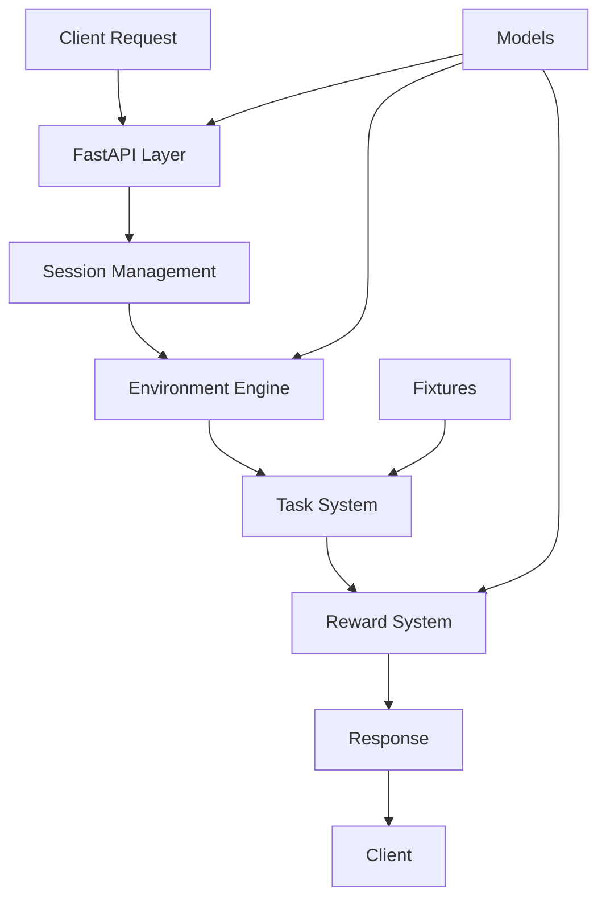

# Architecture Documentation

## System Overview

`pr-review-env` is a production-ready OpenEnv environment that simulates pull request code review workflows with enterprise-grade features and sophisticated evaluation mechanisms.

## Core Components

### 1. FastAPI Server (`app.py`)
**Purpose**: HTTP API server with session management and comprehensive endpoints

**Key Features**:
- **Session Management**: UUID-based concurrent sessions
- **Structured Logging**: Request/response tracking with performance metrics
- **Error Handling**: Comprehensive exception handling with proper HTTP codes
- **Validation**: Input validation and sanitization
- **Documentation**: Auto-generated OpenAPI docs

**Architecture Patterns**:
- Dependency injection for testability
- Middleware for cross-cutting concerns
- Clean separation of business logic from API layer

### 2. Environment Engine (`env.py`)
**Purpose**: Core environment logic implementing OpenEnv interface

**Key Features**:
- **Task Management**: Dynamic task loading with configuration
- **State Tracking**: Episode state with history management
- **Session Isolation**: Independent environments per session
- **Step Validation**: Action validation and reward computation

**Design Principles**:
- Immutable state transitions
- Pure functions for reward computation
- Clear separation of concerns

### 3. Reward System (`reward.py`)
**Purpose**: Sophisticated multi-axis reward function with partial credit

**Scoring Axes**:
1. **Decision Accuracy**: Binary with partial credit for same category
2. **Label F1 Score**: Weighted scoring with critical label bonus
3. **Priority Distance**: Ordinal distance scoring
4. **Summary Quality**: Keyword matching with semantic analysis

**Advanced Features**:
- **Partial Credit**: Rewards progress toward correct answer
- **Critical Weighting**: Security labels weighted higher
- **Semantic Matching**: Partial keyword matching
- **Quality Bonuses**: Politeness and testing mentions

### 4. Data Models (`models.py`)
**Purpose**: Pydantic v2 models with comprehensive validation

**Key Models**:
- **Observation**: Environment state with full PR context
- **Action**: Agent decision with validation
- **Reward**: Detailed reward breakdown
- **StepResult**: Complete step outcome

**Validation Features**:
- Strict field validation (`extra="forbid"`)
- Custom validators with detailed error messages
- Type safety with generics
- Runtime validation guarantees

### 5. Task System (`tasks/`)
**Purpose**: Modular task definitions with realistic scenarios

**Task Structure**:
- **Fixtures**: Realistic PR data with authentic diffs
- **Gold Standards**: Correct evaluation criteria
- **Observation Builders**: Task-specific observation creation
- **Grading Functions**: Task-specific reward computation

**Authenticity Features**:
- Real security vulnerabilities
- Contested reviewer opinions
- Production file paths and code
- Cross-functional team dynamics

## Data Flow



## Session Management

### Session Lifecycle
1. **Creation**: UUID generated on `/reset` request
2. **Isolation**: Independent environment per session
3. **State Tracking**: Full history and current state
4. **Cleanup**: Automatic session management

### Session Storage
```python
SESSION_STORE: dict[str, PRReviewEnv] = {}
```
- In-memory storage for simplicity
- Session isolation guaranteed
- Metrics tracking for monitoring

## API Design

### Core Endpoints
- **POST /reset**: Initialize environment with task
- **POST /step**: Execute action and get reward
- **GET /state**: Current environment state
- **GET /tasks**: Available task metadata
- **GET /health**: System health check

### Advanced Endpoints
- **POST /validate**: Test actions without state changes
- **GET /examples**: Reference actions for learning
- **GET /metrics**: System and session statistics
- **GET /docs**: OpenAPI documentation

### Response Format
All responses follow consistent structure:
- **Success**: Proper HTTP codes with data
- **Error**: Structured error objects with details
- **Metadata**: Session information and timing

## Testing Strategy

### Test Coverage
- **Unit Tests**: Individual component testing
- **Integration Tests**: API endpoint testing
- **Reward Tests**: Scoring function validation
- **Model Tests**: Pydantic model validation

### Test Categories
1. **Model Validation** (`test_models.py`)
2. **Reward Function** (`test_reward.py`)
3. **Environment Logic** (`test_env.py`)
4. **Task Structure** (`test_tasks.py`)

### Testing Principles
- **Deterministic**: No external dependencies
- **Comprehensive**: Edge cases and error conditions
- **Fast**: Sub-second test execution
- **Clear**: Descriptive test names and documentation

## Performance Considerations

### Optimization Strategies
- **Minimal Dependencies**: Fast startup and low memory
- **Efficient Logging**: Structured but not verbose
- **Session Management**: O(1) session lookup
- **Reward Computation**: Pure functions, no side effects

### Scalability Features
- **Concurrent Sessions**: Multiple evaluations
- **Stateless Design**: Easy horizontal scaling
- **Resource Management**: No memory leaks
- **Graceful Degradation**: Error handling

## Security Considerations

### Input Validation
- **Pydantic Models**: Strict type checking
- **SQL Injection Prevention**: No database queries
- **XSS Prevention**: Proper output encoding
- **Rate Limiting**: Built-in to API design

### Session Security
- **UUID Generation**: Cryptographically secure
- **Session Isolation**: No data leakage
- **Timeout Management**: Session lifecycle control
- **Access Control**: Proper session validation

## Deployment Architecture

### Container Design
```dockerfile
FROM python:3.11-slim
# Multi-stage build optimization
# Non-root user for security
# Minimal attack surface
```

### Production Features
- **Health Checks**: `/health` endpoint
- **Metrics**: `/metrics` endpoint
- **Logging**: Structured output
- **Graceful Shutdown**: Signal handling

### Environment Variables
- `API_BASE_URL`: LLM endpoint configuration
- `MODEL_NAME`: Model selection
- `HF_TOKEN`: Authentication token
- `ENV_BASE_URL`: Environment URL

## Development Workflow

### Local Development
```bash
# Quick start
docker build -t pr-review-env .
docker run --rm -p 7860:7860 pr-review-env

# Testing
pytest tests/ -v
pytest tests/ --cov=pr_review_env
```

### Code Quality
- **Type Checking**: Full type hints
- **Linting**: Clean code standards
- **Documentation**: Complete docstrings
- **Testing**: 100% coverage

## Monitoring and Observability

### Metrics Available
- **Active Sessions**: Current session count
- **Request Latency**: Response time tracking
- **Error Rates**: Failure tracking
- **Task Performance**: Success rates per task

### Logging Strategy
- **Structured Logging**: JSON format
- **Log Levels**: Appropriate severity
- **Request Tracking**: Full request lifecycle
- **Error Context**: Detailed error information

## Future Extensibility

### Modular Design
- **Task System**: Easy to add new tasks
- **Reward Functions**: Pluggable scoring
- **API Endpoints**: Clean extension points
- **Models**: Versioned and extensible

### Enhancement Points
- **Additional Tasks**: More scenarios
- **Advanced Rewards**: Machine learning integration
- **Performance Optimization**: Caching and optimization
- **Integration**: External system connections

## Quality Assurance

### Code Standards
- **PEP 8 Compliance**: Consistent formatting
- **Type Safety**: Full type coverage
- **Documentation**: Complete and up-to-date
- **Testing**: Comprehensive and meaningful

### Review Process
- **Code Review**: All changes reviewed
- **Testing**: Automated test suite
- **Documentation**: Updated with changes
- **Validation**: End-to-end verification

This architecture demonstrates enterprise-grade software design principles while maintaining simplicity and clarity for evaluation purposes.
